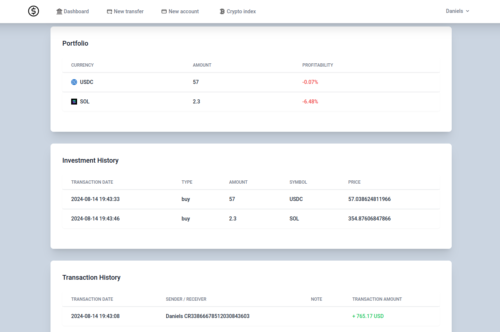
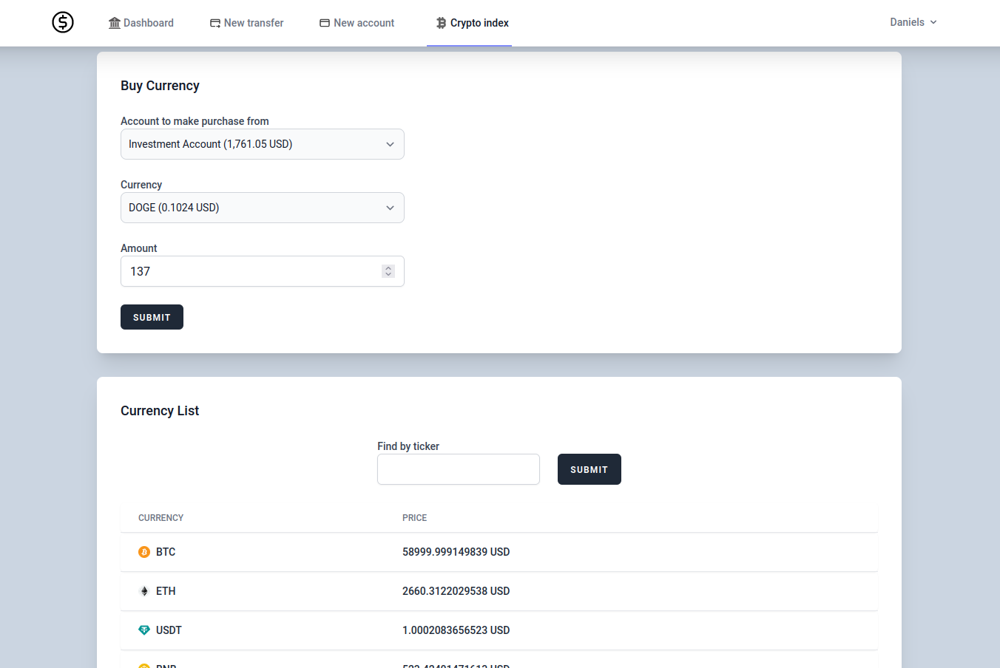

# Mini mock internet bank

A mini mock internet bank made in Laravel
as the final homework project for Codelex.

## Features

* User registration and login system
* Bank account creation and deletion
* Money transfers between accounts
* Investment into cryptocurrencies

## Account view



## Cryptocurrency index



## Requirements

* PHP >= 8.3
* Node.js >= 20.15
* Composer >= 2.7.2

## First time setup

* ```git clone https://github.com/dacie-00/homework-final.git```
* ```composer install```
* ```npm install```
* ```npm run build```
* ```php artisan migrate```
* ```php artisan key:generate```
* Create .env based on .env.example in root directory. In the .env file you need to provide an API key as
  COIN_MARKET_CAP_API_KEY

## Populating currency data from APIs

* ```php artisan app:fetch-currencies```
* ```php artisan app:fetch-crypto-currencies```
* ```php artisan app:fetch-crypto-currency-icons```

## Starting the site

* ```php artisan serve```
